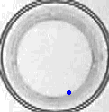

This repository contains python scripts that are used to track animal movement in videos from an experiment.

# Background

Many parasites manipulate the behavior of their hosts. I conducted an experiment in which I infected different strains of copepods (a crustacean) with different strains of tapeworms. The goal was to quantify the extent to which host genes and parasite genes affect behavioral changes in infected hosts.

### Recordings
Copepod behavior was video recorded every second day over the course of parasite development. Copepods were maintained in 24-well plates, with one copepod per well. In each recording, behavior was recorded for one minute and then the well-plate was dropped a few mm in a standardized way to 'frighten' the copepods and recorded an additional minute. These scripts thus take on several tasks, like separating the recording into 'before' and 'after' the drop, identifying each well automatically, and tracking copepod movement.

### Data tables
Information about the videos have been extracted into this [table](video_tbl/video_table_drop.csv). The copepod movement data are included in this [folder](track_data/). 

### Comparing manual and automatic tracking
I also compared the auto tracker with the output of manual tracking. ImageJ was used to reduce the video size to 1 frame per 2 sec, and then copepod position was tracked manually (by clicking on the position frame-by-frame).
