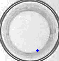
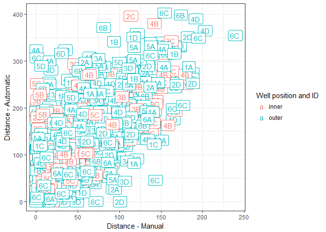
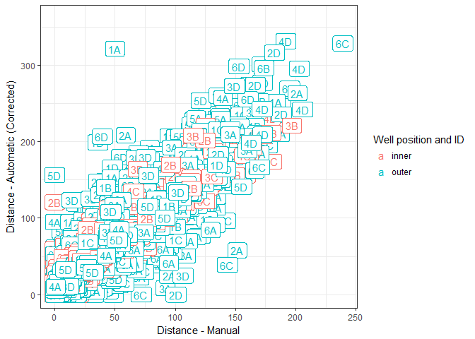

This repository contains python scripts that are used to track animal movement in videos from an experiment.

# Background

Many parasites manipulate the behavior of their hosts. I conducted an experiment in which different strains of copepods (a crustacean) were infected with different strains of tapeworms. The goal was to quantify the extent to which host genes and parasite genes affect behavioral changes in infected hosts.

### Recordings
Copepod behavior was video recorded every other day over the course of parasite development. Copepods were maintained in 24-well plates, with one copepod per well. In each recording, behavior was recorded for one minute and then the well-plate was dropped a few mm in a standardized way to 'frighten' the copepods. They were then recorded an additional minute. These scripts thus take on several tasks, like separating the recording into 'before' and 'after' the drop, identifying each well automatically, and tracking copepod movement.

### Data
Information about the videos have been extracted into this [table](video_tbl/video_table_drop.csv). The raw copepod movement data outputted by the tracker are included in this [folder](track_data/) as csvs. It was clear from assessing the tracker output that there were mistakes (see [here](compare_manual_vs_auto_tracking/testing_automatic_tracker.md)). I therefore corrected the raw csv files to eliminate tracking mistakes; the 'corrected' data are in this [folder](compare_manual_vs_auto_tracking/Fixed_tracker_outputs). 

### Comparing manual and automatic tracking
These videos had previously been processed using a manual tracking plugin in the freeware ImageJ. This was a long process, as the position of the copepod was manually clicked frame-by-frame through a recording (frame rate was reduced to 1 per 2 seconds to reduce the needed clicks).

Though tedious, this manual tracking technique had been used in several previous studies. However, when I started wrangling the manually-tracked data in this experiment, I noticed several mistakes, like incorrect row numbers, missing files, and duplicated frames (see [here](https://github.com/dbenesh82/behav_vid_data_compiler/blob/master/wrangled_data/Quality_control_behav_data.ipynb) for some of those details). Instead of correcting these mistakes one by one, I decided to take a crack at developing an auto tracker. With the combination of auto-tracked and manually-tracked data from the same videos, I can test the validity of the auto-tracking script. I explored the (in)consistencies between trackers in this [notebook](compare_manual_vs_auto_tracking/testing_automatic_tracker.md), and I found that the auto tracker outputted data that was comparable to the manually tracked data.

However, I also noticed that there were mistakes where the auto tracker overestimated copepod movement. I wrote an additional [script](compare_manual_vs_auto_tracking/fix_auto_track_mistakes.R) to 'correct' such tracking mistakes. This improved the correspondence between the auto and manual tracking datasets.

These corrected, auto-tracked data are used in the downstream analyses investigating how much host behavior is influenced by host vs parasite genes.