Comparing automatic tracking and manual tracking of copepod behavior
================
Dan Benesh

I wrote a [script](../03tracking_cop_movement.py) to automatically track copepod movement in video recordings. This notebook explores its accuracy and how it might be improved.

Recordings were two minutes long. After a minute, the well-plates containing the copepods were dropped a few mm in a standardized way to observe the copepod response to a 'shock'. When we plot copepod movement over the two minutes, we clearly see there is a peak at the drop point. The drop happens so fast that copepods cannot be tracked during it. Rather, the spike in movement represents tracking mistakes.

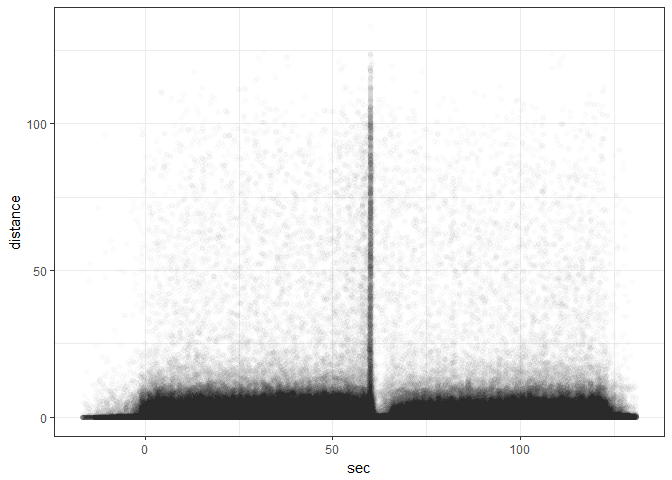

Looking at the distribution of copepod movements, there are some very big values. A value of 120 pixels means it jumped across the whole well in an eighth of a second, which is not realistic.

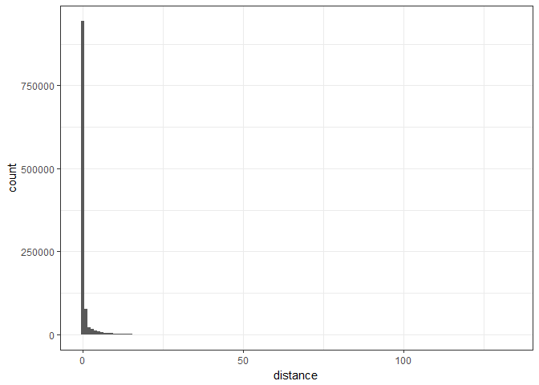

Zooming in on the left-hand side of the distribution, we see that in most frames no movement was recorded. The hump after the null values are likely the common copepod movements.

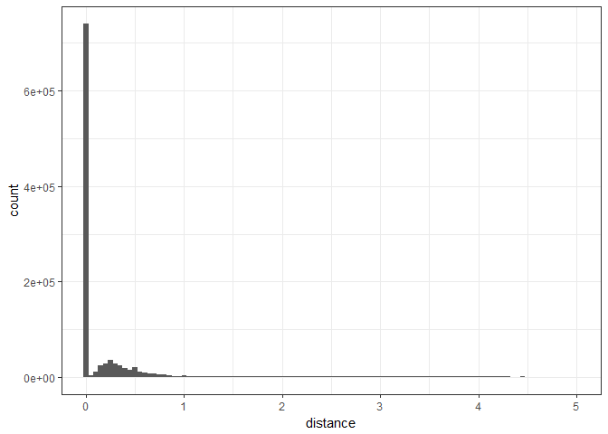

Zooming in on these typical movements, it looks like a right-skewed distribution with a long, fat tail of larger hops.

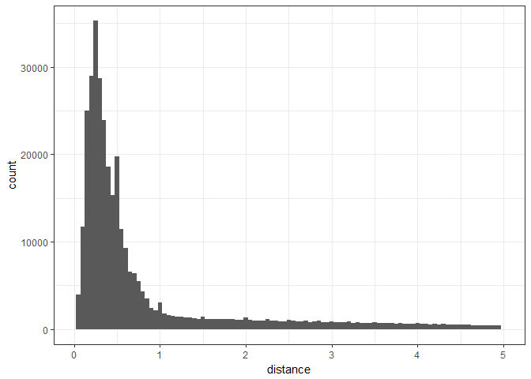

When we zoom in on the far end of the tail, which are presumably mistakes, the distribution appears comparatively flat. This suggests that mistakes can create a range of high values with about equal probability.

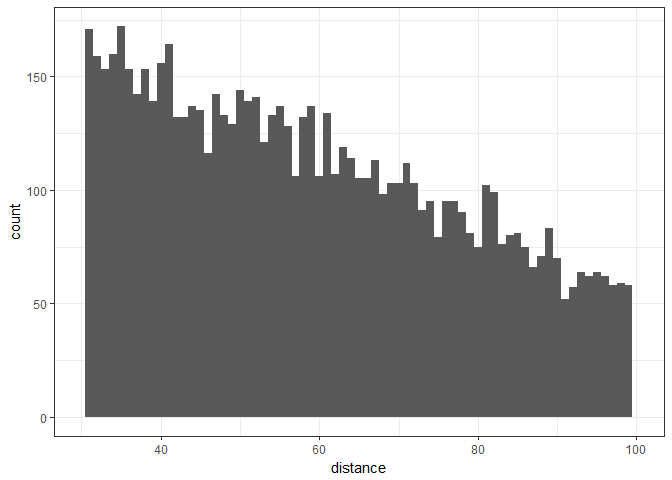

A better overview of the whole distribution is seen when we log transform the movement values. Now, it looks like a mixture of distributions. The largest peak is of small movements, much of which may be just noise, i.e. the tracker oscillating a few pixels. Then, there is a second smaller peak which presumably represents typical copepod movements. Finally, there appears to be another peak which rises after a log value of ~3. These are presumably the tracking mistakes where the tracker mistakenly identifies something besides the copepod far away from the last position.

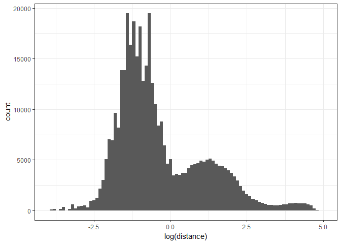

Another way to try and identify mistakes by the auto tracker is to compare it to manual tracking. Let's look at the cumulative distribution of movement values for the auto tracker versus manual tracking. The different time scales of auto vs manual tracking requires scaling for comparison; the auto tracker worked at 8 frames/second while the manual tracking was done at 1 frame/2 seconds. About 100% of the manually tracked values were less than 5 pixels per sec (red line). About 13% of the auto tracked values (black) were larger than this. Some of this discrepancy is surely due to tracking mistakes, but some of it may also be due to the time scale of copepod movements, i.e. they might move similar distances in an 1/8 of a second and in 2 seconds, such that the velocities are much higher for the auto tracker.

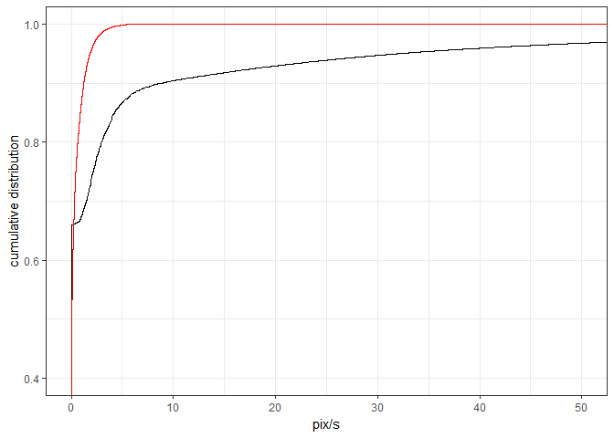

Instead of examining the cumulative distribution for velocities (pixels per second), maybe the total distance moved during a certain time frame is more comparable, i.e. we sum the distances moved over say 2 seconds.

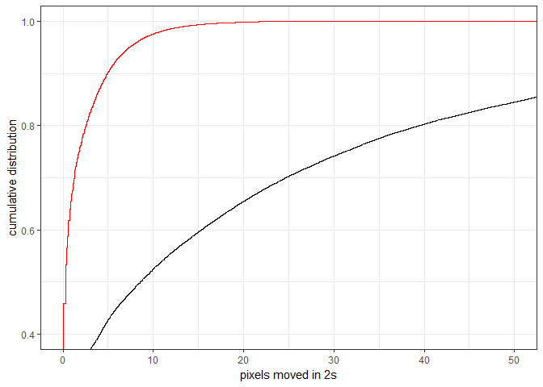

In this case, the manual tracking data still saturates more quickly than the auto tracking data. The larger distances recorded by auto tracking may be due to small movements accumulating (e.g. noisy oscillations) or to accidental measurements of large movements.

Obviously, it would be nice to identify and eliminate tracking mistakes. Two measures of detection quality were saved during tracking: blob size and number of blobs. Blobs are what the tracker detects in each frame. Big blobs are less likely to be static noise in the video. When multiple blobs are detected, it might be a problem with background subtraction in the tracker, which produces static noise that is then identified as movement. In almost all frames, either none or one blob was detected. There are some cases, though, where many blobs were detected.

    ## 
    ##     0     1     2     3     4     5     6     7     8     9    10    11 
    ## 0.626 0.366 0.006 0.001 0.000 0.000 0.000 0.000 0.000 0.000 0.000 0.000 
    ##    12    13    14    15    16    17    18    19    20    21    22    23 
    ## 0.000 0.000 0.000 0.000 0.000 0.000 0.000 0.000 0.000 0.000 0.000 0.000 
    ##    24    25    26    29    32 
    ## 0.000 0.000 0.000 0.000 0.000

If more than 2 blobs are detected, the movements are usually large. Presumably, this happens when something is detected which is not the copepod, and the tracker makes a large 'jump'. After noticing this pattern, I revised the tracker script, so that when multiple blobs are detected, the one closest to the previous location is considered as the copepod. This reduced, but did not eliminate, tracking mistakes.

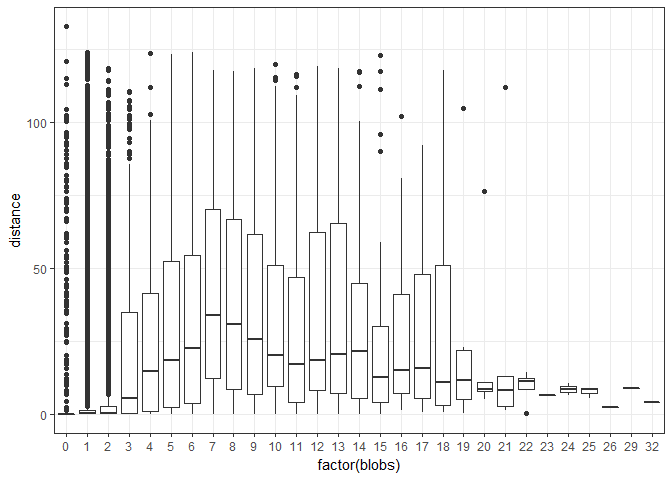

The number of blobs detected is not constant over a recording The transition from before to after the drop is associated with detecting extra blobs, suggesting the tracker is not accurate here. It will probably be necessary to eliminate the 1 second time frame straddling the drop point.

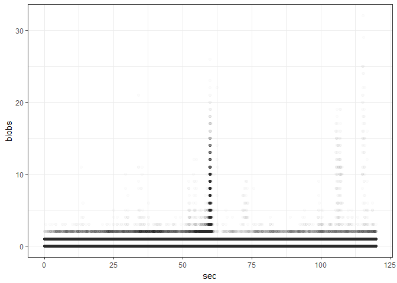

Turning to blob size, this metric does not seem to be related to time. The gap after the drop at 60s shows how copepods tend to stop moving after this 'shock' and are thus not detected.

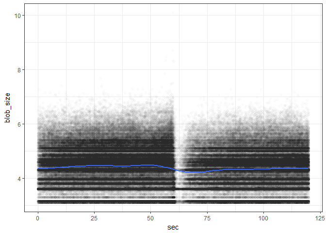

Blob size is not strikingly multimodal, though the smallest values seem somewhat overrepresented and are perhaps unreliable.

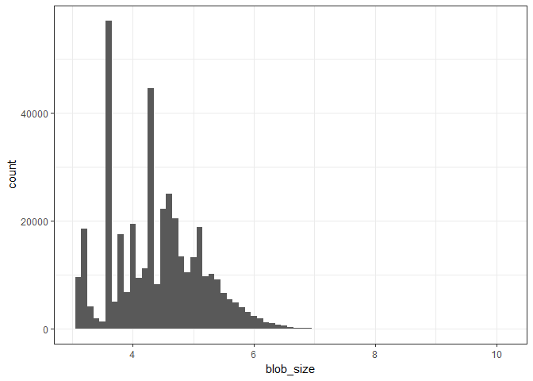

Supporting this, the smallest blobs tend to move large distances. Increasing the blob size filtered out by the tracker, though, reduces detection sensitivity. It is a tradeoff, and I settled on a value based on considerable trial and error.

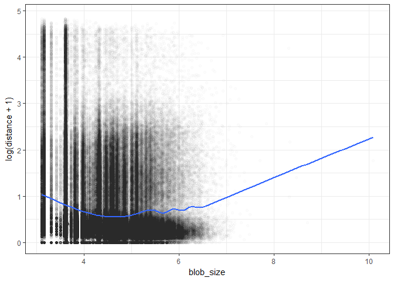

Looking at the interaction between blob size, blobs detected, and distance moved, we see that detecting multiple blobs, with a small blob size, is associated with larger movements. The combination of multiple blobs and a small blob size seems to be associated with tracking mistakes.

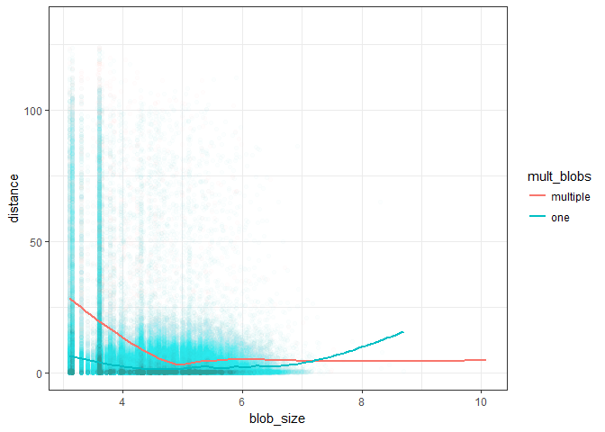

So the tracker is not perfect, but let's see how it compares to our manual tracking. We'll plot the total distance moved by the copepod, with manual tracking on the x and auto tracking on the y.

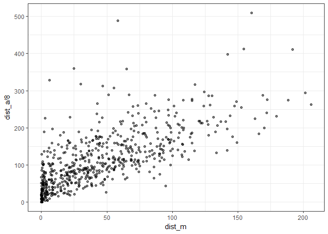

The correlation is clear, but there is a lot of variation (R2 is ~0.5). Additionally, the slope of the correlation is greater than 1 with a positive intercept, both of which indicate the auto tracker has the copepods traveling a larger distance during the recording.

    ## 
    ## Call:
    ## lm(formula = dist_a/8 ~ dist_m, data = bd_comb)
    ## 
    ## Residuals:
    ##     Min      1Q  Median      3Q     Max 
    ## -136.73  -36.89  -11.78   25.08  356.43 
    ## 
    ## Coefficients:
    ##             Estimate Std. Error t value Pr(>|t|)    
    ## (Intercept) 55.42334    3.36004   16.50   <2e-16 ***
    ## dist_m       1.31451    0.05348   24.58   <2e-16 ***
    ## ---
    ## Signif. codes:  0 '***' 0.001 '**' 0.01 '*' 0.05 '.' 0.1 ' ' 1
    ## 
    ## Residual standard error: 55.19 on 612 degrees of freedom
    ## Multiple R-squared:  0.4968, Adjusted R-squared:  0.496 
    ## F-statistic: 604.2 on 1 and 612 DF,  p-value: < 2.2e-16

In the scatterplot above, there are obviously some cases where the auto-tracker recorded much more movement than manual tracking. I checked whether certain wells seemed more prone to be outliers, e.g. maybe wells on the outer edge of the well-plates exhibited more reflections or other noise because they were not at the center of the video frame. It is not obvious that a single well position was commonly an outlier (the position of each the 24 wells is indicated by a combo of a number (1 to 6) and a letter (A to D)). But wells on the outer edge of the plate may be more prone to overestimating movement, presumably due to tracking mistakes.

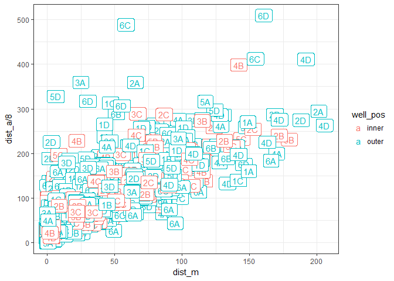

I played with the parameters of the tracker to try and limit such tracking mistakes. However, when I increased the blob size filter (i.e. removing small, possibly false positive blobs), then I created some outliers in the other direction, where the auto tracker found far less movement than manual tracking. Thus, instead of decreasing tracker sensitivity, I decided to try and eliminate tracking mistakes after the fact.

Next, I removed suspicious data points and re-assessed the correlation between automatic and manual tracking. I removed data points with large jumps, with large changes of direction, and with more than 2 blobs detected.

The slope of the correlation gets closer to 1, the intercept closer to 0, and R2 increases to 0.76, all of which can be considered an improvement. This is not to say that all mistakes are eliminated, but enough are to make tedious manual tracking and fast automatic tracking comparable.

    ## 
    ## Call:
    ## lm(formula = dist_a/8 ~ dist_m, data = bd_comb)
    ## 
    ## Residuals:
    ##      Min       1Q   Median       3Q      Max 
    ## -116.732   -8.712   -3.172   10.029  100.174 
    ## 
    ## Coefficients:
    ##             Estimate Std. Error t value Pr(>|t|)    
    ## (Intercept)  6.69818    1.57846   4.243 2.54e-05 ***
    ## dist_m       1.10522    0.02512  43.993  < 2e-16 ***
    ## ---
    ## Signif. codes:  0 '***' 0.001 '**' 0.01 '*' 0.05 '.' 0.1 ' ' 1
    ## 
    ## Residual standard error: 25.93 on 612 degrees of freedom
    ## Multiple R-squared:  0.7597, Adjusted R-squared:  0.7594 
    ## F-statistic:  1935 on 1 and 612 DF,  p-value: < 2.2e-16

It is also important to put tracking mistakes within the context of the aims of the experiment: to test for differences between treatments (uninfected vs infected copepods). Presumably, mistakes are randomized across treatments and thus not a source of bias. Let's compare the treatment differences in the auto-tracking and manual-tracking datasets.

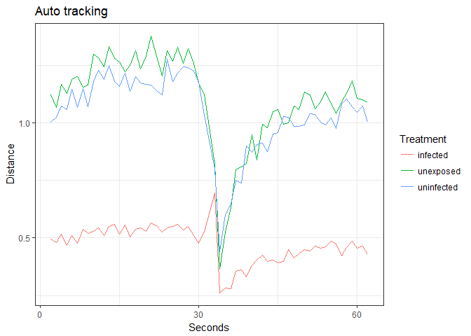

In both cases, infected copepods move less than uninfected copepods, and a clear response to the drop is observed, with reduced activity afterwards. Perhaps the auto-tracker records less movement at beginning of recordings than manual tracking, but overall the patterns are quite comparable.

Up to this point, I have focused on the distance/speed of copepod movement, not the direction. We can quantify changes in direction with the dot products between consecutive two vectors. Here's the distribution of dot products, measured with the auto-tracker.

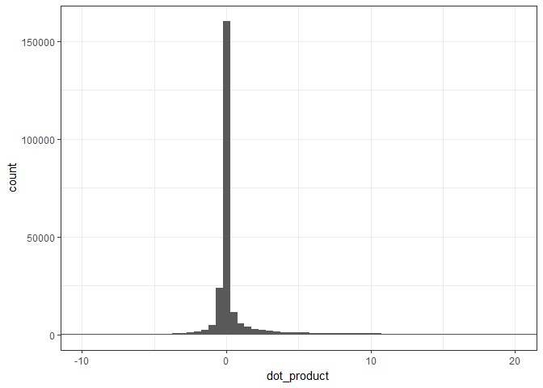

Mostly, they are zero, which makes sense because in most frames copepods did not move. There is also a tendency for the data to skew positive, suggesting copepods tend to continue moving in the same direction, as opposed to changing directions between frames.

The largest dot products occur around the drop point and skew negative, which indicates big jumps in the opposite direction to prior movement. While that is consistent with escape behavior, I think this is due to tracking mistakes.

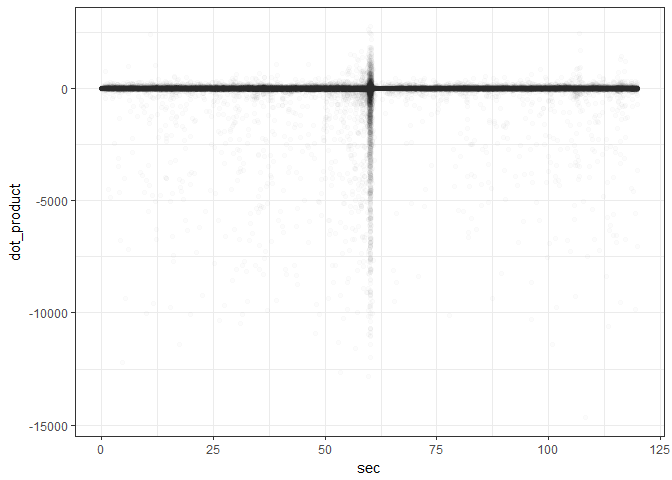

Zooming in, we can see the overall positive skew (more positive than negative dot products), but there is not an obvious change over time, such as more or less negative dot products after being scared.

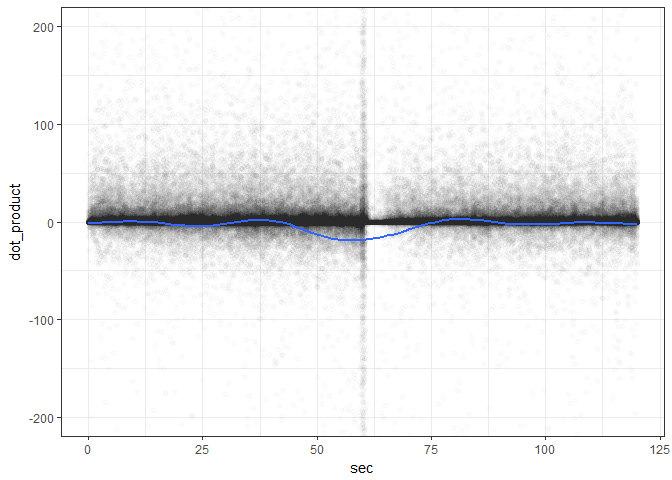

The dot product combines information about the magnitude and direction of movements, so it makes sense to check whether it is independent from the distance variable. The next scatterplot shows distance versus dot product, with the largest copepod movements eliminated. Large movements can have zero dot products (i.e. a large jump after being stationary), positive dot products (i.e. a jump in the same direction as previous movement), or negative dot products (i.e. a change of direction).

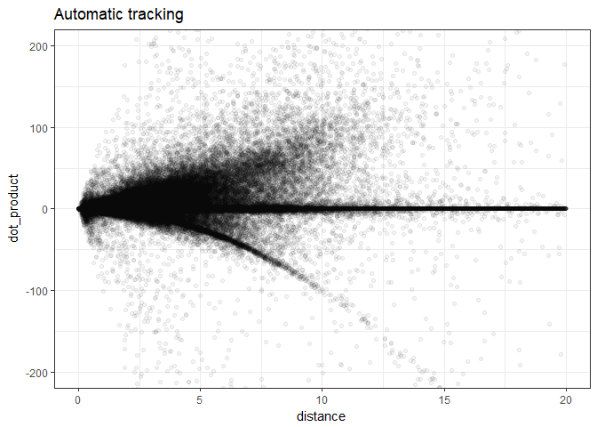

There appear to be negative dot products that follow a convex arc. This probably represents mistakes where the tracker jumps to something other than the copepod and then right back. This seems especially suspicious when we look at the same graph for the manual tracking data; here it is absent. The same positive skew can be observed though.

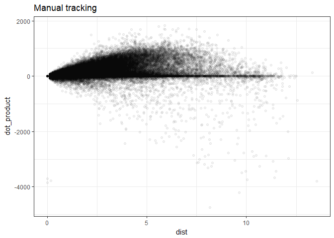

Before digging too deep into the dot product data, let's compare the dot product among treatments.

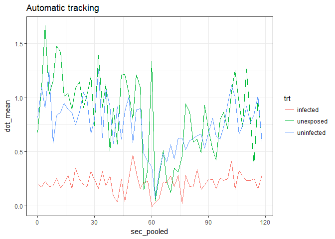

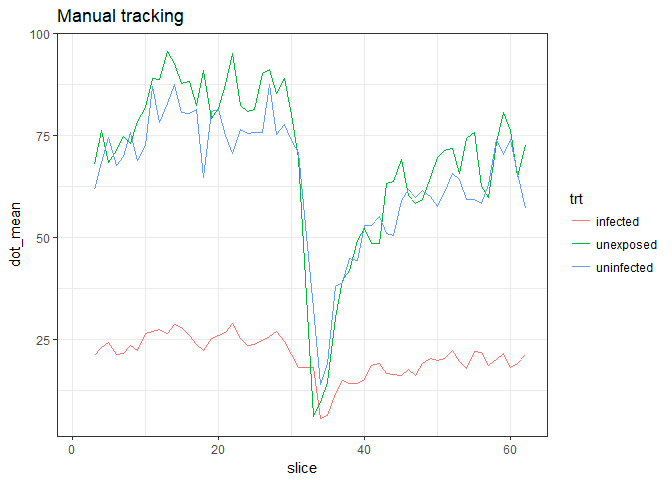

For both auto and manual tracking, the dot product was lower for infected copepods than uninfected copepods. This could be due to infecteds moving less (they do) or changing direction more (more negative values).

To try and disentangle these, we can plot the dot product as a function of the distance moved in the last two frames (from which the dot product is calculated). The funnel pattern in the plot demonstrates how the movement constrains dot product values. The trend lines are suggestive that infecteds have lower dot products when they move larger distances.

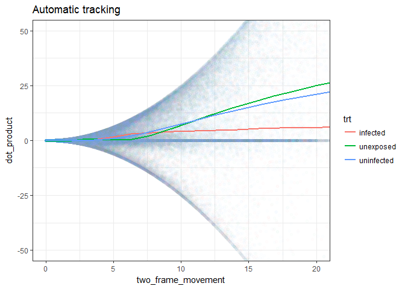

However, when we just take a slice of the x-axis in the above scatter plot (between 10 and 20 pixels), we find that the distribution of dot products is quite similar for all treatments.

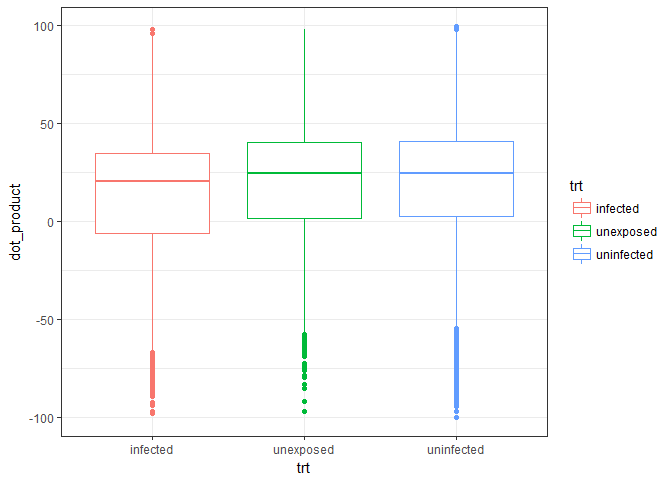

Thus, for this aspect of behavior, there is not an obvious difference between treatment groups. The pattern is essentially the same for the manual tracking data (not shown).

One final characteristic to compare between infected and uninfected copepods is the variation in copepod movements. When moving a given distance, are movements slow and steady or quick and jerky? For each recording, I calculated the variation in distance moved per frame. The variation in movement scales well with the total distance moved in a recording, as we would expect. It does not look like, at a given level of activity, infected and uninfected copepods differ much.

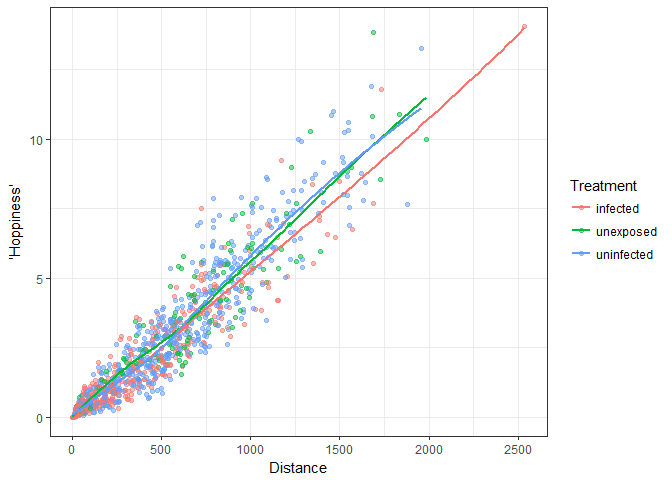

Conclusion
==========

Here I evaluated how well an automatic tracker performed relative to tedious manual tracking. The results from auto and manual tracking were comparable and correlated. However, I also identified likely indicators of tracking mistakes, such as large movements with conspicuous directional changes. Moreover, I explored whether different behavioral metrics differed between infected and uninfected copepods; activity was lower in infected copepods, but they did not have obviously more zig-zaggy (dot product) or jerky movements (movement variability).
